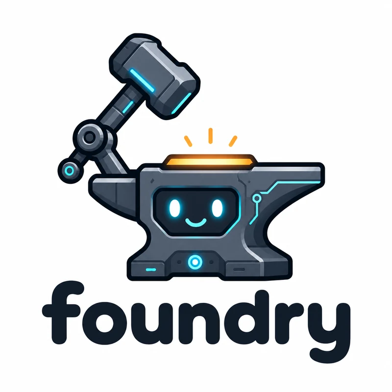

<p align="center">
  
</p>

<h1 align="center">Foundry</h1>

<p align="center">
  <strong>Forge reliable, observable, and testable AI agent systems in .NET.</strong>
</p>

<p align="center">
  <a href="https://github.com/ncosentino/foundry/actions/workflows/ci.yml"></a>
  <a href="https://github.com/ncosentino/foundry/actions/workflows/docs.yml"></a>
  <a href="https://www.nuget.org/packages/NexusLabs.Foundry.MicrosoftAgentFramework"></a>
  <a href="LICENSE"></a>
  <a href="https://dotnet.microsoft.com/"></a>
  
</p>

Foundry is an AI and agentic application framework for .NET. It brings agent
construction, orchestration, diagnostics, evaluation, experimentation,
provider integrations, and deterministic testing into one composable package
family.

Foundry is dependency-injection neutral at its core. Use standard
`IServiceCollection` registration, or add the optional Needlr integrations
when you want source-generated discovery and Needlr's plugin-oriented
composition model.

> [!IMPORTANT]
> Foundry is alpha software. Package IDs, namespaces, and APIs may change
> before the first stable release.

## Installation

Install the core Microsoft Agent Framework runtime:

```powershell
dotnet add package NexusLabs.Foundry.MicrosoftAgentFramework --version 0.1.0-alpha-0001
```

Add the workflow, generator, analyzer, provider, or Needlr integration packages
that match your application. See [Getting Started](docs/getting-started.md) for
the recommended package combinations.

## Why Foundry?

AI prototypes are easy to start and difficult to operate. Foundry focuses on
the parts that become important after the first successful prompt:

- **Declarative agents and workflows** with generated registries and typed
  factory methods.
- **Composable orchestration** for sequential, handoff, group-chat, graph, and
  iterative-loop workloads.
- **Provider-neutral evaluation** with retries, concurrency limits,
  deterministic and statistical policies, and publication pipelines.
- **Built-in observability** for agent runs, tool calls, token usage, progress,
  budgets, and pipeline performance.
- **Replaceable integrations** for Microsoft Agent Framework, MEAI Reporting,
  Langfuse, GitHub Copilot, Semantic Kernel, and Needlr.
- **Deterministic testing tools** for generated functions, agents, workflows,
  and scripted model interactions.

## Package map

| Package | Purpose |
|---|---|
| `NexusLabs.Foundry.MicrosoftAgentFramework` | Agent construction, context, diagnostics, progress, workspace, and topology declarations |
| `NexusLabs.Foundry.MicrosoftAgentFramework.Workflows` | Sequential, handoff, group-chat, and graph workflow execution |
| `NexusLabs.Foundry.MicrosoftAgentFramework.Testing` | Deterministic agent and workflow testing |
| `NexusLabs.Foundry.MicrosoftAgentFramework.DevUI` | Microsoft Agent Framework DevUI integration |
| `NexusLabs.Foundry.MicrosoftAgentFramework.Generators` | Compile-time agent, function, and workflow registries |
| `NexusLabs.Foundry.MicrosoftAgentFramework.Analyzers` | Compile-time agent and topology validation |
| `NexusLabs.Foundry.Evaluation` | MEAI evaluation and provider-neutral experiments |
| `NexusLabs.Foundry.Evaluation.Reporting` | MEAI Reporting adapter |
| `NexusLabs.Foundry.Langfuse` | Langfuse telemetry, datasets, scoring, and experiment publication |
| `NexusLabs.Foundry.Copilot` | GitHub Copilot `IChatClient` and web-search integration |
| `NexusLabs.Foundry.Needlr.MicrosoftAgentFramework` | Optional Needlr integration for Foundry agents |
| `NexusLabs.Foundry.Needlr.SemanticKernel` | Optional Needlr integration for Semantic Kernel |
| `NexusLabs.Foundry.Needlr.SemanticKernel.Generators` | Compile-time Semantic Kernel plugin registration for Needlr |

Neutral Foundry packages never depend on Needlr. Needlr-specific behavior is
isolated under `NexusLabs.Foundry.Needlr.*`.

## A small example

```csharp
using Microsoft.Extensions.DependencyInjection;

using NexusLabs.Foundry.MicrosoftAgentFramework;
using NexusLabs.Foundry.MicrosoftAgentFramework.Workflows.Diagnostics;

var services = new ServiceCollection();
services.AddFoundryAgentFramework(builder => builder
    .UsingChatClient(chatClient)
    .UsingDiagnostics());

using var provider = services.BuildServiceProvider();
var agent = provider
    .GetRequiredService<IAgentFactory>()
    .CreateAgent<ResearchAgent>();

var response = await agent.RunAsync(
    "Compare the trade-offs of reflection and source generation.",
    cancellationToken: CancellationToken.None);

[FoundryAgent(
    Instructions = "Research the request and return a concise, sourced answer.")]
internal sealed partial class ResearchAgent
{
}
```

The source generator discovers the agent declaration and produces the
registries used by `IAgentFactory`. Reflection-based discovery remains
available where runtime flexibility is more important than trimming or
NativeAOT.

## Documentation

- [Documentation source](docs/index.md)
- [Agent Framework integrations and workflows](docs/ai-integrations.md)
- [Provider-neutral experiment runner](docs/experiment-runner.md)
- [Langfuse integration](docs/langfuse.md)
- [Testing tools](docs/testing-tools.md)
- [Versioned API reference](docs/api/index.md)
- [Architecture decisions](docs/adr/adr-0004-extract-ai-platform-from-needlr.md)

The public documentation target is
[www.devleader.ca/projects/foundry](https://www.devleader.ca/projects/foundry/).

## Examples

The solution includes 30 compile-validated example projects under
[`src/Examples`](src/Examples):

- generated agents and functions;
- sequential, handoff, group-chat, and graph workflows;
- iterative loops, progress dashboards, diagnostics, and token metrics;
- provider-neutral experiments, MEAI Reporting, and Langfuse;
- GitHub Copilot and Semantic Kernel integrations;
- NativeAOT and generator-coexistence checks.

## Build from source

```powershell
dotnet build src\NexusLabs.Foundry.slnx
```

Build the documentation locally with:

```powershell
python -m pip install --requirement requirements-docs.txt
python -m mkdocs build --strict
```

Trusted Linux CI jobs support isolated
[PitCrew](https://github.com/ncosentino/pitcrew) runners. See
[Local CI Runners](docs/local-runners.md) for routing and fork-safety details.

## About

Foundry is built by **Nick Cosentino**, creator of
[Dev Leader](https://www.devleader.ca) and
[BrandGhost](https://www.brandghost.ai).

Find Nick online:

- [Blog and software engineering articles](https://www.devleader.ca)
- [YouTube](https://www.youtube.com/@devleader)
- [Dev Leader Weekly newsletter](https://weekly.devleader.ca)
- [LinkedIn](https://linkedin.com/in/nickcosentino)
- [All links](https://links.devleader.ca)

## Contributing

Issues and pull requests are welcome. For substantial behavioral or
architectural changes, open an issue first so the intended package boundary
and public API can be discussed before implementation.

## License

Foundry is licensed under the [MIT License](LICENSE).
